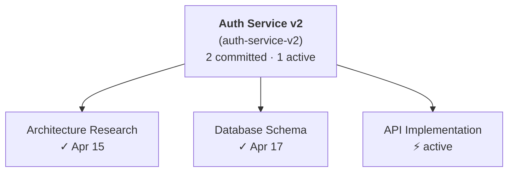

# cctree

**Hierarchical session management for [Claude Code](https://claude.ai/code) with bidirectional context flow.**

> [Leia em Português](README.pt-BR.md)

## The Problem

When working on a multi-week project with Claude Code, you end up creating dozens of sessions: one for architecture decisions, another for implementing a feature, another to debug a bug, another to write tests. Every time you start a new session, you lose all the context from previous ones and have to re-explain the project, paste docs, and repeat yourself.

But losing context between sessions is only half the problem. The other half is **needing to go back**. You're deep in an implementation session and hit a bug that's related to an architecture decision you made three sessions ago. The only way to get useful help is to switch back to that architecture session, because that's where Claude has the full context of *why* things were designed that way. So you leave your implementation session, scroll through `/resume` trying to find the right one, ask your question there, then switch back and manually relay the answer. This constant session-hopping breaks your flow and wastes time.

`--fork-session` helps with the first problem, but it's one-directional: the child gets the parent's history, but what the child learns never flows back. And it doesn't help with the second problem at all: you still can't query a sibling session's knowledge from where you are.

**cctree fixes both.** It creates a session tree where knowledge flows in both directions: parent to child (context injection) and child to parent (commit back). Each new session starts with the accumulated wisdom of every session before it. And when you need details from a specific sibling session, the `get_sibling_context` tool lets you read its committed summary without leaving your current session.

## How It Works

```
                    ┌─────────────────────┐
                    │   Auth Service v2    │  <- parent (context accumulator)
                    │                     │
                    │  context.md grows    │
                    │  with each commit    │
                    └──────────┬──────────┘
                               │
            ┌──────────────────┼──────────────────┐
            │                  │                  │
   ┌────────▼────────┐ ┌──────▼───────┐ ┌────────▼────────┐
   │  Architecture   │ │   Database   │ │  API Endpoints  │
   │  Research       │ │   Schema     │ │  Implementation │
   │                 │ │              │ │                 │
   │ commit back ────┤ │ commit back ─┤ │ commit back ────┤
   └─────────────────┘ └──────────────┘ └─────────────────┘
```

1. You create a **tree** (the parent) with initial context docs
2. You create **branches** (child sessions) for specific tasks
3. Each child session opens Claude Code with all accumulated context injected
4. When a child session finishes, Claude **commits** a structured summary back to the parent
5. The next child session automatically inherits everything

The parent is not a Claude session. It's a managed document on disk that grows as children commit back. No context window is wasted on a "hub" session.

## Quick Start

### Install

```bash
npm install -g @railima/cctree
```

### Register the MCP server (one time)

```bash
cctree mcp-install
```

This registers `cctree` as an MCP server so Claude Code sessions have access to the `commit_to_parent`, `get_tree_status`, `get_sibling_context`, `export_mermaid`, `export_obsidian`, and `export_report` tools.

### Create your first tree

```bash
cctree init "Auth Service v2" --context docs/auth-spec.md docs/api-design.md
```

This creates a tree called "Auth Service v2" and copies your spec files as initial context.

### Start working

```bash
# Session 1: research and architecture decisions
cctree branch "Architecture Research"
```

Claude Code opens with your spec files already in context. Work normally. When you're done:

```
You: commit what we decided to the parent

Claude: [uses commit_to_parent tool]
Committed summary for "Architecture Research" to tree "Auth Service v2".
Accumulated context: 4.2 KB (1 sessions committed).
```

```bash
# Session 2: inherits everything from session 1
cctree branch "Database Schema"
```

This session already knows every architecture decision from session 1. When done, commit again. Session 3 will know everything from sessions 1 and 2, and so on.

## Use Cases

### Software Release Planning

You're shipping a new feature that spans backend, frontend, and infrastructure. Each area needs its own deep-dive session, but they all need to share context.

```bash
cctree init "Payment Integration" --context docs/payment-spec.md
cctree branch "Provider Research"         # compare Stripe vs Adyen vs PayPal
# ... commit back ...
cctree branch "Database Schema Design"    # design tables knowing the provider choice
# ... commit back ...
cctree branch "API Implementation"        # implement knowing schema + provider
# ... commit back ...
cctree branch "Frontend Integration"      # build UI knowing the full API
```

### Cross-Session Knowledge Queries

You're implementing API endpoints and hit a problem that relates to an architecture decision from an earlier session. Without cctree, you'd have to leave your current session, find the architecture session via `/resume`, ask your question there, then switch back and relay the answer manually.

With cctree, the architecture session's summary is already in your context. And if you need more detail:

```
You: I'm getting a circular dependency between the auth middleware and
     the user service. What did we decide about the dependency graph
     in the architecture session?

Claude: [uses get_sibling_context with name "Architecture Decisions"]
        In the architecture session, we decided to use an event-driven
        pattern to break circular dependencies: the auth middleware
        publishes a "user.authenticated" event and the user service
        subscribes to it, rather than direct imports.
```

No session switching. No copy-pasting. The knowledge from every committed session is queryable from wherever you are.

### Bug Investigation

A complex production bug that requires multiple investigation angles:

```bash
cctree init "Memory Leak Investigation" --context logs/error-dump.txt metrics/grafana-export.json
cctree branch "Log Analysis"
# ... commit back findings ...
cctree branch "Heap Dump Analysis"       # knows what logs already revealed
# ... commit back ...
cctree branch "Fix Implementation"       # knows root cause from both analyses
```

### Technical Spec to Implementation

Turn a spec into working code across multiple sessions:

```bash
cctree init "Notification System" --context specs/notifications-rfc.md
cctree branch "Architecture Decisions"    # decide message broker, patterns
# ... commit back ...
cctree branch "Core Service Scaffold"     # implement base knowing architecture
# ... commit back ...
cctree branch "Email Channel"             # implement knowing core service API
# ... commit back ...
cctree branch "Push Channel"              # implement knowing core + email patterns
```

### Research and Documentation

Accumulate knowledge across multiple research sessions:

```bash
cctree init "Cloud Migration Assessment"
cctree branch "Current Infrastructure Audit"
# ... commit back ...
cctree branch "AWS vs GCP Cost Analysis"    # knows current infra details
# ... commit back ...
cctree branch "Migration Plan Draft"        # knows infra + cost analysis
# ... commit back ...
cctree branch "Risk Assessment"             # full picture from all prior research
```

## CLI Reference

### `cctree init <name> [--context <files...>]`

Create a new session tree.

```bash
cctree init "My Project" --context spec.md plan.md architecture.md
cctree init "Quick Investigation"    # no initial context files
```

- Copies context files to `~/.cctree/trees/<slug>/initial-context/`
- Sets this tree as the active tree
- Generates the initial `context.md`

### `cctree branch <name> [--no-open] [--worktree [branch]]`

Create a child session and open Claude Code.

```bash
cctree branch "API Design"
cctree branch "Prototype" --no-open         # create entry without opening Claude
cctree branch "API Design" --worktree       # isolate in a git worktree
cctree branch "API Design" -w feature/api   # worktree with a specific branch name
```

- Rebuilds `context.md` with all committed siblings
- Injects context via `--append-system-prompt-file`
- Opens Claude Code with `--name "TreeName > ChildName"`
- Writes active session state for MCP tools

**With `--worktree`:** cctree creates a linked [git worktree](https://git-scm.com/docs/git-worktree) at `~/.cctree/trees/<tree-slug>/worktrees/<child-slug>/` on a fresh branch (default name: `cctree/<tree-slug>/<child-slug>`, branched from the current `HEAD` of the tree's working directory). Claude Code launches inside the worktree, so sibling sessions can run in parallel without trampling each other's files. `cctree resume` will also reopen the session there. If the branch name you pass already exists, it's checked out into the worktree instead of being created.

Cleanup (for now, manual — a dedicated command will come in a follow-up):

```bash
git worktree remove ~/.cctree/trees/<tree-slug>/worktrees/<child-slug>
git branch -D cctree/<tree-slug>/<child-slug>
```

### `cctree resume <name>`

Resume an existing child session.

```bash
cctree resume "API Design"
cctree resume api-design        # also accepts slugs
```

### `cctree list [--all]`

Show the session tree.

```bash
cctree list           # show active tree only
cctree list --all     # show all trees
```

Output:
```
Auth Service v2 (auth-service-v2) (active)
├── [committed] Architecture Research (Apr 16)
├── [committed] Database Schema (Apr 17)
├── [active]    API Implementation
└── [abandoned] Old Approach
```

The slug in parentheses is the one you can pass to `cctree use` or `cctree resume`.

### `cctree status`

Show details about the active tree.

```bash
cctree status
```

Output:
```
Tree: Auth Service v2
Slug: auth-service-v2
Created: 4/16/2026
Working dir: /home/user/projects/auth-service
Sessions: 4 total (2 committed, 1 active)
Context files: 2
Context size: 8.3 KB
```

### `cctree context [--raw]`

Print the accumulated context document.

```bash
cctree context          # print to terminal
cctree context --raw    # raw markdown (useful for piping)
```

### `cctree context add <files...> [--tree <name>]`

Add initial-context files to an existing tree. Useful when you forgot to pass
`--context` on `cctree init`, or when new docs become relevant after the tree
was created.

```bash
cctree context add spec.md plan.md               # adds to the active tree
cctree context add spec.md --tree auth-service   # adds to a specific tree
```

- Copies files into `~/.cctree/trees/<slug>/initial-context/`
- Updates `tree.json` and rebuilds `context.md`
- Subsequent `cctree branch` / `cctree resume` sessions will include the new files

### `cctree use <name>`

Switch the active tree.

```bash
cctree use "Payment Integration"
cctree use payment-integration
```

### `cctree abandon <name> [--delete] [--tree <t>]`

Retire a child session you no longer need. Two modes:

```bash
cctree abandon "Old Approach"              # mark as abandoned (soft)
cctree abandon "Old Approach" --delete     # delete entirely (hard)
cctree abandon old-approach --tree auth    # target a specific tree
```

- **Soft (default)**: flips the child's status to `abandoned`. It stays in `cctree list` so the history is preserved, but it's excluded from the accumulated context injected into future sessions. Use this when you want a record of "we tried this and dropped it."
- **Hard (`--delete`)**: removes the child from `tree.json`, deletes its committed summary, and — if the child was created with `--worktree` — also `git worktree remove`s the worktree and deletes the auto-named branch (`cctree/<tree>/<child>`). Custom branch names you passed to `--worktree <branch>` are left alone so you don't lose work by accident. The worktree directory is force-removed as a fallback if git refuses.
- Clears `~/.cctree/active-session.json` if it pointed at the deleted child.

### `cctree rename <new-name> [--slug <new-slug>] [--tree <t>]`

Rename a tree. Display-only by default; pass `--slug` to also rename the on-disk identifier.

```bash
cctree rename "Auth Service v3"                    # display name only
cctree rename "Auth v3" --slug auth-v3             # also move the directory + branches
cctree rename "Auth v3" --tree auth-service-v2     # target a non-active tree
```

- **Display-only**: updates `tree.json`'s `name` and regenerates `context.md`. Existing Claude conversations keep their session names, so `cctree resume` continues to work for previously created children.
- **With `--slug`**: moves `~/.cctree/trees/<old>/` to `~/.cctree/trees/<new>/`, updates the active-tree pointer and `active-session.json` if needed, and for every child with an auto-named worktree branch (`cctree/<old-slug>/<child>`): renames the git branch to `cctree/<new-slug>/<child>` and repairs git's internal worktree bookkeeping for the new path. Custom-named branches are preserved.
- Fails fast if the target slug is already taken by another tree.

### Exports

`cctree` ships three export commands that turn the accumulated tree state into artifacts you can share, paste, or navigate outside the terminal. Each one is intentionally output-format-specific rather than a single "one size fits all" exporter:

| Command | Output | Audience |
| --- | --- | --- |
| `cctree export mermaid` | A Mermaid `graph TD` block | Quick paste-in for PRs, docs, release notes |
| `cctree export obsidian <vault>` | Wiki-linked markdown in an Obsidian vault | Navigable "brain"-style graph view |
| `cctree export report <tree>` | Shareable markdown progress report | Sprint-level visibility for a tech lead |

All three are also exposed as MCP tools (`export_mermaid`, `export_obsidian`, `export_report`) so Claude can invoke them directly when you ask — see the [MCP Tools section](#mcp-tools-inside-claude-code) below.

### `cctree export mermaid [--tree <name>] [--output <file>]`

Render the session trees as a [Mermaid](https://mermaid.js.org/) graph diagram. GitHub, Obsidian, Notion, and VSCode all render Mermaid natively, so the output pastes directly into PR descriptions, docs, or release notes.

```bash
cctree export mermaid                          # all trees → stdout
cctree export mermaid --tree auth-service-v2   # one tree only
cctree export mermaid --output docs/roadmap.md # write to a file
cctree export mermaid > docs/roadmap.md        # or just pipe
```

Children are colored by status: committed (green), active (yellow), abandoned (gray dashed). The tree node shows session counts so you get project-level overview at a glance:



### `cctree export obsidian <vault-path> [--tree <name>]`

Export the session trees as a set of wiki-linked markdown files for [Obsidian](https://obsidian.md/). Open the vault in Obsidian and you get a navigable "brain"-style graph view of every tree, child, and — when summaries mention them — the code files those sessions touched.

```bash
cctree export obsidian ~/vaults/my-brain                          # all trees
cctree export obsidian ~/vaults/my-brain --tree auth-service-v2   # single tree
```

The command writes under `<vault>/cctree/`:

```
<vault>/cctree/
  index.md                            # MOC — links to every tree
  <tree-slug>/
    _index.md                         # tree overview with child links
    <child-slug>.md                   # one file per committed child
```

Each committed child file gets YAML frontmatter (tree, status, dates, tags, worktree-branch), the full summary content verbatim, wiki-links back to the tree and sibling children, and — if the summary mentions file paths like `src/auth.ts` or `db/migrate/001_users.rb` — a `## Related files` section that links them as Obsidian wiki-links. Those file links become gray nodes in the graph view that get progressively "lit up" as multiple releases touch the same files, giving you a natural view of the project's hot zones.

Children that are `active` or `abandoned` are listed in the tree's `_index.md` but do not get their own file — only committed summaries are materialized.

**Idempotent**: re-running the command **overwrites** `<vault>/cctree/` entirely. Files anywhere else in the vault (including your own notes) are never touched. With `--tree`, only that tree's subfolder is regenerated and `index.md` is left alone.

### `cctree export report <tree> [--children <slugs>] [--author <name>] [--output <file>]`

Generate a **shareable progress report** for one tree. Designed for end-of-sprint reporting: the dev runs this, reviews the markdown, and shares it with their tech lead so they can see what was worked on, which gaps remain open, and where the product is evolving — without reading every session transcript.

```bash
cctree export report auth-service-v2                                   # all sessions
cctree export report auth-service-v2 --children research,impl          # cherry-pick
cctree export report auth-service-v2 --output sprint-42.md             # to a file
cctree export report auth-service-v2 --author "Rai Lima"               # override
```

The report aggregates every session's content under cross-cutting headings so the reader absorbs the **tree as a whole**, not a session-by-session transcript:

- **Decisions** — every `## Decisions` bullet from every committed summary, grouped by which session made it. This is the map of how the product is evolving.
- **Open questions** — every `## Open Questions` bullet still in the tree. For a tech lead, this is the most valuable section: "what is my team still figuring out?"
- **Artifacts delivered** — every `## Artifacts Created` entry, deduplicated.
- **Hot files** — a ranked table of file paths mentioned across multiple sessions. The top rows are where the product surface is concentrating — a natural signal for merge risk and architectural pressure.
- **Timeline** — a Mermaid gantt chart (date-only) showing when each session started and ended.
- **Structure** — a Mermaid graph of the scoped tree (same renderer as `cctree export mermaid`).
- **Session detail** — one collapsible `<details>` block per session with the full summary verbatim, for drill-down.

The report's author is detected from `git config user.name` in the current working directory, falling back to the OS username. Override with `--author "Name"` when you need to.

**Design principles worth calling out**:
- **Dev-controlled**. This is an explicit export the dev runs, reviews, and shares. There is no remote-query mechanism. The ritual ("dev shares at end of sprint") matters more than the artifact.
- **Neutral framing for exploration**. Abandoned children are labeled *Explored (parked)* with a note explaining they represent conscious decisions not to pursue a direction — that is valuable product-direction signal, not failure.
- **One tree per report**. Reports are single-tree so each one stays focused and readable. Running this across multiple trees means running it multiple times.

### `cctree statusline [--format <template>]`

Print a compact single-line summary of the current cctree session. Intended for Claude Code's custom [status line](https://code.claude.com/docs/en/statusline), tmux, or any other shell-composed status display. The command prints nothing (and exits 0) when there is no active cctree session, so it composes cleanly with other statusline segments.

```bash
cctree statusline
# Output: Auth Service v2 › API Design

cctree statusline --format '{tree_slug}/{child_slug} [{committed}/{total}]'
# Output: auth-service-v2/api-design [2/5]
```

Placeholders: `{tree}`, `{tree_slug}`, `{child}`, `{child_slug}`, `{committed}`, `{active}`, `{total}`.

When Claude Code pipes its [session JSON](https://code.claude.com/docs/en/statusline#available-data) to the command on stdin, `cctree statusline` uses the `session_name` field (populated by `cctree branch` via `--name`) to resolve the tree/child. This means you can have multiple concurrent Claude sessions and each statusline will show the correct tree. When stdin is absent, it falls back to `~/.cctree/active-session.json`.

Register it in `~/.claude/settings.json`:

```json
{
  "statusLine": {
    "type": "command",
    "command": "cctree statusline"
  }
}
```

### `cctree mcp-install [--scope <scope>]`

Register the cctree MCP server with Claude Code.

```bash
cctree mcp-install                  # default: user scope
cctree mcp-install --scope local    # current project only
```

## MCP Tools (Inside Claude Code)

These tools are available to Claude inside sessions launched via `cctree branch`:

### `commit_to_parent`

Commits a structured summary back to the parent tree.

**When to use:** At the end of a session when the user says "commit", "save to parent", "sync back", or similar.

**Summary format:**
```markdown
## Decisions
- Chose PostgreSQL over MongoDB for ACID compliance
- REST API with versioned endpoints (/v1/...)

## Artifacts Created
- Migration file: db/migrate/001_create_users.rb
- API controller: app/controllers/users_controller.rb

## Open Questions
- Should we use JWT or session-based auth?

## Next Steps
- Implement authentication middleware
- Add rate limiting
```

### `get_tree_status`

Shows the tree structure with all children and their statuses. Useful for understanding what work has been done and what's pending.

### `get_sibling_context`

Reads a specific sibling session's committed summary. Useful when you need details from a specific prior session beyond what's in the accumulated context.

```
You: what did we decide about the database in the schema session?
Claude: [uses get_sibling_context with name "Database Schema"]
```

### `export_mermaid`

Returns the whole session-tree state as a [Mermaid](https://mermaid.js.org/) `graph TD` block. Claude can call this when you ask to "visualize the tree", "summarize the sessions as a diagram", or anything similar — no need to remember the CLI shape. Optionally takes a `tree` argument to filter. Unlike the other tools, this one does **not** require being inside a cctree session, so Claude can render the diagram from any repo.

```
You: draw me a diagram of where we are across all releases
Claude: [uses export_mermaid] → pastes the diagram into chat, which your
        client renders natively
```

### `export_obsidian`

Exports the session trees as wiki-linked markdown into an existing Obsidian vault. Mirrors `cctree export obsidian <vault>`: creates a `cctree/` subfolder with a MOC, one subfolder per tree, and one file per committed child (frontmatter + summary verbatim + wiki-links to siblings and to any file paths mentioned in the summary). Idempotent; never touches files outside `<vault>/cctree/`. Takes `vaultPath` (required) and an optional `tree` filter.

```
You: sync the auth-service-v2 tree to my Obsidian vault at ~/vaults/work
Claude: [uses export_obsidian with vaultPath="~/vaults/work", tree="auth-service-v2"]
```

### `export_report`

Generates the shareable progress report described above — same output as `cctree export report <tree>`, but Claude returns the markdown directly in chat so you can review and paste it. Takes `tree` (required) and optional `children` (array of slugs) and `author` overrides. No active session required; Claude can generate reports for any tree from any repo.

```
You: gera o report da árvore auth-service-v2 pra eu mandar pro tech lead
Claude: [uses export_report with tree="auth-service-v2"] → returns the full
        markdown; you review it, tweak if needed, and share

You: só as sessões de research e implementação
Claude: [uses export_report with tree="auth-service-v2",
        children=["research","impl"]]
```

## Multiple Trees

You can maintain multiple trees simultaneously for different projects or releases:

```bash
cctree init "Auth Service v2" --context docs/auth-spec.md
cctree init "Payment Integration" --context docs/payment-spec.md
cctree init "Q3 Performance Sprint" --context docs/perf-targets.md

cctree list --all
# Auth Service v2 (auth-service-v2)
#     (no sessions yet)
#
# Payment Integration (payment-integration)
#     (no sessions yet)
#
# Q3 Performance Sprint (q3-performance-sprint) (active)
#     (no sessions yet)

cctree use "Auth Service v2"     # switch context
cctree branch "Token Refresh"    # work on auth
# ...
cctree use "Payment Integration" # switch to another release
cctree branch "Webhook Handler"  # work on payments
```

Each tree is fully independent. Switching trees is instant since all state is file-based.

## Integration Ideas

### Creating trees from JIRA/Linear/CSV

Since `cctree init` and `cctree branch` are CLI commands, you can script them. For example, to create a tree from a CSV of JIRA tickets:

```bash
# tickets.csv:
# key,summary
# AUTH-101,Token refresh flow
# AUTH-102,Session management
# AUTH-103,SSO integration

cctree init "Auth Service v2" --context docs/auth-spec.md

while IFS=, read -r key summary; do
  cctree branch "$key: $summary" --no-open
done < <(tail -n +2 tickets.csv)

cctree list
# Auth Service v2 (auth-service-v2) (active)
# ├── [active] AUTH-101: Token refresh flow
# ├── [active] AUTH-102: Session management
# └── [active] AUTH-103: SSO integration
```

Or use Claude Code itself to read your JIRA board and create the tree:

```
You: Read the tickets from docs/jira-export.csv and create a cctree
     branch for each one, grouped by epic.

Claude: [reads CSV, runs cctree init + cctree branch --no-open for each ticket]
```

### Feeding context from external sources

Initial context files can be anything: specs, API docs, database schemas, log dumps, architecture diagrams (as text). You can also generate them dynamically:

```bash
# Pull current schema as context
pg_dump --schema-only mydb > /tmp/schema.sql

# Pull recent error logs
kubectl logs deploy/api --since=24h > /tmp/recent-errors.log

cctree init "Prod Bug Fix" --context /tmp/schema.sql /tmp/recent-errors.log
```

### CI/CD Integration

After a tree is complete, export the accumulated context as a release document:

```bash
cctree context --raw > docs/releases/auth-v2-decisions.md
git add docs/releases/auth-v2-decisions.md
git commit -m "Add Auth v2 release decisions"
```

## How Context Flows

When you run `cctree branch "Database Schema"`, here is what happens:

1. cctree reads the tree's `context.md` (which contains initial context + all committed summaries)
2. Writes it to a temporary file
3. Opens Claude with `claude --name "Auth Service v2 > Database Schema" --append-system-prompt-file <temp-file>`
4. Writes `~/.cctree/active-session.json` so MCP tools know which tree/child is active

When Claude uses `commit_to_parent`:

1. Saves the summary to `~/.cctree/trees/<slug>/children/database-schema.md`
2. Updates `tree.json` to mark the child as "committed"
3. Rebuilds `context.md` by concatenating initial context + all committed children (chronologically)

The rebuilt `context.md` looks like:

```markdown
# Context: Auth Service v2

## Initial Context

### auth-spec.md
[original spec content]

### api-design.md
[original API design content]

## Session: Architecture Research (Apr 16, 2026)

### Decisions
- Chose microservices over monolith
- Event-driven communication via Redis Streams

### Artifacts Created
- docs/architecture-diagram.md

## Session: Database Schema (Apr 17, 2026)

### Decisions
- PostgreSQL with UUID primary keys
- Separate auth and user profile tables

### Artifacts Created
- db/migrate/001_create_auth_tables.rb
```

## Data Storage

All data is stored locally in `~/.cctree/`:

```
~/.cctree/
├── active-tree                    # slug of the current tree
├── active-session.json            # current tree + child (for MCP server)
└── trees/
    └── auth-service-v2/
        ├── tree.json              # tree config + children metadata
        ├── context.md             # auto-generated accumulated context
        ├── .inject-context.md     # temp file for Claude injection
        ├── initial-context/
        │   ├── auth-spec.md
        │   └── api-design.md
        └── children/
            ├── architecture-research.md
            └── database-schema.md
```

No data is sent to external services. Everything is local files.

## Requirements

- Node.js >= 20
- [Claude Code CLI](https://claude.ai/code) installed and authenticated

## Contributing

Contributions are welcome. Please open an issue first to discuss what you'd like to change.

```bash
git clone https://github.com/railima/cctree.git
cd cctree
npm install
npm test          # 44 tests
npm run build     # produces dist/
npm run lint      # type-check
```

## License

[MIT](LICENSE)
