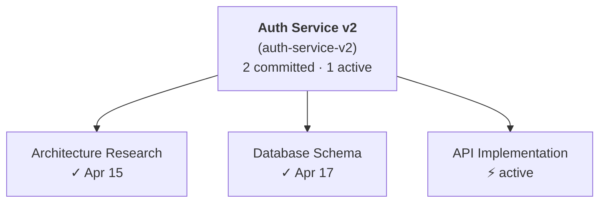

# cctree

**A session tree for [Claude Code](https://claude.ai/code): organize related conversations into searchable, durable trees with bidirectional context flow.**

> [Leia em Português](README.pt-BR.md)

cctree is two tools in one:

- **A knowledge organizer** for everything you do with Claude Code — group conversations into trees by sprint, release, or topic; tag them; search across them later. `cctree list --all`, `cctree find <query>`, `cctree export mermaid` give you a queryable record of what you worked on, when, and what you decided.
- **A bidirectional context bus** between related sessions — the layered TL;DR + Decisions + Artifacts of every committed child is automatically injected into every new sibling. No re-explaining, no copy-pasting, no session-hopping to look up "what did we decide about X?".

You can use either side without the other. Most users start using cctree for organization (because the search and structure are immediately useful) and graduate to the context flow as their trees grow.

## The Problems It Solves

**1. Conversations vanish into a flat history.** Claude Code's session list is a chronological scroll. If a teammate asks "did you ever look into the OAuth refresh bug?", you're skimming session names trying to remember which one. cctree gives you `cctree find "oauth"` and an organized tree per sprint/release/topic.

**2. Every new session starts from zero.** You design a database schema in one session, then implement endpoints in another. The implementation session has none of the design context unless you re-explain it. `--fork-session` clones a session's history, but it's one-directional and doesn't help when the relevant decisions live in a *sibling* session you opened a week ago. cctree injects every committed sibling's TL;DR + Decisions + Artifacts automatically.

**3. Cross-session knowledge queries are manual.** You're deep in implementation and hit a bug that ties back to an architecture decision three sessions ago. Without cctree, you switch sessions, ask there, switch back, and copy the answer. With cctree, the answer is already in your context — and if you need more detail, the `get_sibling_context` MCP tool reads the full committed notes of any sibling without leaving your current session.

**4. Token bloat from accumulated context.** A naive "inject everything" approach grows linearly with every commit. cctree's commit summaries are layered: only TL;DR + Decisions + Artifacts get injected; verbose `## Details` stay on disk and are read on demand. The injected context stays compact even after dozens of committed sessions.

## How It Works

A **tree** is a managed document on disk (not a Claude session — it doesn't burn its own context window). You create child sessions under it, work, and commit a structured summary back. The next sibling inherits everything committed so far.

```
                    ┌─────────────────────┐
                    │   Auth Service v2   │  <- parent: context.md grows with each commit
                    │                     │     (just a file in ~/.cctree, not a session)
                    │  TL;DR + Decisions  │
                    │  + Artifacts        │
                    └──────────┬──────────┘
                               │ injected as system prompt
            ┌──────────────────┼──────────────────┐
            │                  │                  │
   ┌────────▼────────┐ ┌───────▼──────┐ ┌─────────▼───────┐
   │  Architecture   │ │   Database   │ │  API Endpoints  │
   │  Research       │ │   Schema     │ │  Implementation │
   │                 │ │              │ │                 │
   │ commit back ────┤ │ commit back ─┤ │ commit back ────┤
   └─────────────────┘ └──────────────┘ └─────────────────┘
        │                    │                   │
        └────────────────────┴───────────────────┘
                  searchable via `cctree find`,
                  visualizable via `cctree export mermaid`
```

1. **`cctree init <name>`** — create a tree, optionally with reference docs as initial context
2. **`cctree branch <name> [--tags ...]`** — create a child session; Claude Code opens with the accumulated layered context already injected
3. **`commit_to_parent`** — when the work is done, Claude (or you) commits a summary with `## TL;DR`, `## Decisions`, optional `## Artifacts` / `## Open Questions` / `## Next Steps` / `## Details`
4. **Next sibling automatically inherits** the TL;DR + Decisions + Artifacts of every committed session before it
5. **Search and review later** — `cctree list --all`, `cctree list --tag <tag>`, `cctree find <query>`, or in a Claude Code chat `/mcp__cctree__export_architecture`

## Quick Start

### Install

```bash
npm install -g @railima/cctree
```

### Register the MCP server (one time)

```bash
cctree mcp-install
```

This registers `cctree` as an MCP server so Claude Code sessions have access to the `commit_to_parent`, `get_tree_status`, `get_sibling_context`, `export_mermaid`, `export_obsidian`, `export_report`, and `get_architecture_context` tools — plus the `/mcp__cctree__export_architecture` slash-command prompt.

### Create your first tree

```bash
cctree init "Auth Service v2" --context docs/auth-spec.md docs/api-design.md
```

This creates a tree called "Auth Service v2" and copies your spec files as initial context.

### Start working

```bash
# Session 1: research and architecture decisions
cctree branch "Architecture Research"
```

Claude Code opens with your spec files already in context. Work normally. When you're done:

```
You: commit what we decided to the parent

Claude: [uses commit_to_parent tool]
Committed summary for "Architecture Research" to tree "Auth Service v2".
Accumulated context: 4.2 KB (1 sessions committed).
```

```bash
# Session 2: inherits everything from session 1
cctree branch "Database Schema"
```

This session already knows every architecture decision from session 1. When done, commit again. Session 3 will know everything from sessions 1 and 2, and so on.

## Use Cases

cctree gets used three ways in practice. Each maps to a different shape of work; pick the one that fits — the tool doesn't enforce a particular layout.

| Pattern | Tree = | Children = | What you get |
| --- | --- | --- | --- |
| **Release container** | A release / feature / MCP server | Research → POC → implementation → polish | Bidirectional context flow shines: each stage starts with every prior stage's decisions already in scope. |
| **Sprint container** | One sprint | One ticket per child (tagged with ticket IDs) | Searchable record of "did I work on TICKET-X?" + sprint-end retro material. |
| **Knowledge container** | A long-running topic (auth, observability, infra, vendor research) | Each notable conversation, dated and tagged | A queryable lab-notebook of decisions across months of work. |

The three patterns share the same primitives — what differs is which features you lean on most. Concrete walkthroughs below.

### Release container — context flows downhill

You're shipping a feature that spans backend, frontend, and infra. Each area needs its own deep-dive session, but they all need to share context.

```bash
cctree init "Payment Integration" --context docs/payment-spec.md docs/api-design.md

cctree branch "Provider Research"         # compare Stripe vs Adyen vs PayPal
# ... work, then in Claude: "commit"
cctree branch "Database Schema Design"    # opens with provider choice already injected
# ... work, then commit
cctree branch "API Implementation"        # knows schema + provider
# ... commit
cctree branch "Frontend Integration"      # knows the full API surface
```

Each `cctree branch` opens Claude Code with the accumulated TL;DR + Decisions + Artifacts of all committed siblings already in the system prompt. **No re-explaining**. And when you hit something that needs more detail than the TL;DR captured, ask Claude — it'll call `get_sibling_context` automatically:

```
You: I'm getting a circular dependency between the auth middleware and
     the user service. What did we decide about that in the
     architecture session?

Claude: [calls get_sibling_context("Architecture Research")]
        You decided to break the cycle with an event-driven pattern —
        the auth middleware publishes `user.authenticated` and the user
        service subscribes, rather than direct imports. The reasoning
        was that direct imports would force auth to depend on the user
        service's typings...
```

No session-hopping. No copy-pasting between sessions. The knowledge of every committed session is queryable from wherever you are.

When the release ships, ask Claude in your chat — `/mcp__cctree__export_architecture tree=payment-integration` — and it produces a diagram (Mermaid, an HTML page, ASCII, your call) of the architectural decisions and flows that emerged across the sessions, useful for PR descriptions, retro docs, or onboarding the next person who'll touch the area.

Same shape applies to bug investigations (children = log analysis → heap dump → fix), technical specs (children = architecture → service scaffold → channel implementations), and any other work where one stage's decisions feed into the next.

### Sprint container — searchable record of "what did I do?"

You run a sprint with a handful of tickets. Each ticket gets its own session; tags let you search them later.

```bash
cctree init "Sprint 23"

cctree branch "TICKET-1234 OAuth refresh bug" --tags ticket-1234,bug
# work the ticket, commit when done

cctree branch "TICKET-1240 Add idempotency keys" --tags ticket-1240,feature
# ...

cctree branch "TICKET-1247 Investigate slow query" --tags ticket-1247,perf
```

Two weeks later, your tech lead asks "did you ever look into the slow query in checkout?" Instead of skimming session names:

```bash
$ cctree find "slow query"
Sprint 23 (sprint-23)
  child-name > TICKET-1247 Investigate slow query: TICKET-1247 Investigate slow query
  decision > TICKET-1247 Investigate slow query: Added a partial index on orders(checkout_status, created_at)
  artifact > TICKET-1247 Investigate slow query: db/migrate/20260315_orders_checkout_index.rb

3 matches.
```

Or filter the list view by tag:

```bash
$ cctree list --all --tag perf
Sprint 23 (sprint-23)
└── [committed] TICKET-1247 Investigate slow query (Mar 15) #ticket-1247 #perf
```

End of sprint, generate a retro report with `cctree export report sprint-23 --output retro.md`.

### Knowledge container — a queryable lab-notebook

For long-running topics where conversations don't have a natural "release" boundary — auth, observability, vendor evaluations, ops incidents — use one tree per topic and treat each notable conversation as a child. Tags help you slice later.

```bash
cctree init "Auth Platform"

cctree branch "JWT vs paseto vs sessions" --tags research,vendor-eval
# ...
cctree branch "OIDC provider comparison" --tags research,vendor-eval
# ...
cctree branch "Prod incident: token leak 2026-04" --tags incident,postmortem
# ...
cctree branch "Refresh-token rotation design" --tags design,decision
```

Three months later: "wait, did we ever decide on JWT or sessions?"

```bash
$ cctree find "jwt"
Auth Platform (auth-platform)
  tldr > JWT vs paseto vs sessions: Compared JWT, PASETO, and stateful sessions; chose JWT with rotation
  decision > JWT vs paseto vs sessions: Use JWT with 15-min access + 30-day refresh
  decision > Refresh-token rotation design: Rotate refresh tokens on every use; revoke on family compromise

3 matches.
```

Filter by `--tag incident` to surface only postmortems. Filter by `--tag decision` for only architectural calls. Inside a Claude Code chat, run `/mcp__cctree__export_architecture tree=auth-platform` for a diagram of how the decisions connect across the topic.

### When NOT to use cctree

cctree is overhead for one-off questions or single-session work. You don't need a tree for "fix this typo" or "what does this regex do?". The investment pays off when:

- You'll come back to this work over multiple sessions
- The sessions are related enough that decisions in one affect another, **or**
- You want to be able to search/review what you did later

If a single `claude` session does the job, just use `claude`.

## CLI Reference

### `cctree init <name> [--context <files...>]`

Create a new session tree.

```bash
cctree init "My Project" --context spec.md plan.md architecture.md
cctree init "Quick Investigation"    # no initial context files
```

- Copies context files to `~/.cctree/trees/<slug>/initial-context/`
- Sets this tree as the active tree
- Generates the initial `context.md`

### `cctree branch <name> [--no-open] [--worktree [branch]] [--tags <list>]`

Create a child session and open Claude Code.

```bash
cctree branch "API Design"
cctree branch "Prototype" --no-open                    # create entry without opening Claude
cctree branch "API Design" --worktree                  # isolate in a git worktree
cctree branch "API Design" -w feature/api              # worktree with a specific branch name
cctree branch "TICKET-1234" --tags ticket-1234,bug     # tag for later search
```

- Rebuilds `context.md` with all committed siblings
- Injects context via `--append-system-prompt-file`
- Opens Claude Code with `--name "TreeName > ChildName"`
- Writes active session state for MCP tools

**With `--tags`:** comma-separated list, normalized to lowercase-with-dashes (`Sprint 2, Bug Fix` → `sprint-2`, `bug-fix`). Tags are persisted on the child and surfaced by `cctree list --tag <tag>`, `cctree list --search <query>`, and `cctree find <query>`. The MCP `commit_to_parent` tool also accepts a `tags` argument so Claude can tag (or re-tag) a session at commit time without you having to re-run `cctree branch`.

**With `--worktree`:** cctree creates a linked [git worktree](https://git-scm.com/docs/git-worktree) at `~/.cctree/trees/<tree-slug>/worktrees/<child-slug>/` on a fresh branch (default name: `cctree/<tree-slug>/<child-slug>`, branched from the current `HEAD` of the tree's working directory). Claude Code launches inside the worktree, so sibling sessions can run in parallel without trampling each other's files. `cctree resume` will also reopen the session there. If the branch name you pass already exists, it's checked out into the worktree instead of being created.

Cleanup (for now, manual — a dedicated command will come in a follow-up):

```bash
git worktree remove ~/.cctree/trees/<tree-slug>/worktrees/<child-slug>
git branch -D cctree/<tree-slug>/<child-slug>
```

### `cctree resume <name>`

Resume an existing child session.

```bash
cctree resume "API Design"
cctree resume api-design        # also accepts slugs
```

### `cctree list [--all] [--tag <tag>] [--search <query>]`

Show the session tree.

```bash
cctree list                          # show active tree only
cctree list --all                    # show all trees
cctree list --tag ticket-1234        # only sessions tagged "ticket-1234"
cctree list --search oauth           # only sessions with "oauth" in name/tags/TL;DR/decisions
cctree list --all --search payment   # search across every tree
```

Output (with tags):
```
Auth Service v2 (auth-service-v2) (active)
├── [committed] Architecture Research (Apr 16) #research #spike
├── [committed] Database Schema (Apr 17) #ticket-1234
├── [active]    API Implementation
└── [abandoned] Old Approach
```

The slug in parentheses is the one you can pass to `cctree use` or `cctree resume`.

`--tag` matches a tag exactly (case-insensitive). `--search` is a case-insensitive substring match against tree/session names, tags, and the **TL;DR + Decisions + Artifacts** of committed sessions (Open Questions / Next Steps / Details are intentionally not searched). For broader, multi-tree retrieval grouped by where the hit landed, use `cctree find`.

### `cctree find <query>`

Search every tree for hits in tree/session names, tags, TL;DR, decisions, and artifacts. Useful for "did I work on ticket X?" and "where did we decide Y?" lookups.

```bash
cctree find ticket-1234
cctree find "oauth refresh"
```

Output groups matches by tree and labels each by which field hit:

```
Sprint 2 (sprint-2)
  tag > TICKET-1234 auth bug: #ticket-1234
  decision > TICKET-1234 auth bug: Use a mutex around token refresh

MCP Release (mcp-release)
  decision > Transport research: Use stdio transport

3 matches.
```

Exits with code 1 (no matches) for use in shell pipelines.

### `cctree status`

Show details about the active tree.

```bash
cctree status
```

Output:
```
Tree: Auth Service v2
Slug: auth-service-v2
Created: 4/16/2026
Working dir: /home/user/projects/auth-service
Sessions: 4 total (2 committed, 1 active)
Context files: 2
Context size: 8.3 KB
```

### `cctree context [--raw]`

Print the accumulated context document.

```bash
cctree context          # print to terminal
cctree context --raw    # raw markdown (useful for piping)
```

### `cctree context add <files...> [--tree <name>]`

Add initial-context files to an existing tree. Useful when you forgot to pass
`--context` on `cctree init`, or when new docs become relevant after the tree
was created.

```bash
cctree context add spec.md plan.md               # adds to the active tree
cctree context add spec.md --tree auth-service   # adds to a specific tree
```

- Copies files into `~/.cctree/trees/<slug>/initial-context/`
- Updates `tree.json` and rebuilds `context.md`
- Subsequent `cctree branch` / `cctree resume` sessions will include the new files

### `cctree use <name>`

Switch the active tree.

```bash
cctree use "Payment Integration"
cctree use payment-integration
```

### `cctree abandon <name> [--delete] [--tree <t>]`

Retire a child session you no longer need. Two modes:

```bash
cctree abandon "Old Approach"              # mark as abandoned (soft)
cctree abandon "Old Approach" --delete     # delete entirely (hard)
cctree abandon old-approach --tree auth    # target a specific tree
```

- **Soft (default)**: flips the child's status to `abandoned`. It stays in `cctree list` so the history is preserved, but it's excluded from the accumulated context injected into future sessions. Use this when you want a record of "we tried this and dropped it."
- **Hard (`--delete`)**: removes the child from `tree.json`, deletes its committed summary, and — if the child was created with `--worktree` — also `git worktree remove`s the worktree and deletes the auto-named branch (`cctree/<tree>/<child>`). Custom branch names you passed to `--worktree <branch>` are left alone so you don't lose work by accident. The worktree directory is force-removed as a fallback if git refuses.
- Clears `~/.cctree/active-session.json` if it pointed at the deleted child.

### `cctree rename <new-name> [--slug <new-slug>] [--tree <t>]`

Rename a tree. Display-only by default; pass `--slug` to also rename the on-disk identifier.

```bash
cctree rename "Auth Service v3"                    # display name only
cctree rename "Auth v3" --slug auth-v3             # also move the directory + branches
cctree rename "Auth v3" --tree auth-service-v2     # target a non-active tree
```

- **Display-only**: updates `tree.json`'s `name` and regenerates `context.md`. Existing Claude conversations keep their session names, so `cctree resume` continues to work for previously created children.
- **With `--slug`**: moves `~/.cctree/trees/<old>/` to `~/.cctree/trees/<new>/`, updates the active-tree pointer and `active-session.json` if needed, and for every child with an auto-named worktree branch (`cctree/<old-slug>/<child>`): renames the git branch to `cctree/<new-slug>/<child>` and repairs git's internal worktree bookkeeping for the new path. Custom-named branches are preserved.
- Fails fast if the target slug is already taken by another tree.

### Exports

`cctree` ships three export commands that turn the accumulated tree state into artifacts you can share, paste, or navigate outside the terminal. Each one is intentionally output-format-specific rather than a single "one size fits all" exporter:

| Command | Output | Audience |
| --- | --- | --- |
| `cctree export mermaid` | A Mermaid `graph TD` block (structure) | Quick paste-in for PRs, docs, release notes |
| `/mcp__cctree__export_architecture` (in chat) | An architecture artifact (Mermaid diagram, standalone HTML page, ASCII diagram, …) synthesized by the Claude in your chat from the tree's TL;DRs + Decisions + Artifacts | PR descriptions and retros that need to show *what was decided*, not *which sessions ran* |
| `cctree export obsidian <vault>` | Wiki-linked markdown in an Obsidian vault | Navigable "brain"-style graph view |
| `cctree export report <tree>` | Shareable markdown progress report | Sprint-level visibility for a tech lead |

All four are also exposed via MCP — `export_mermaid`, `export_obsidian`, `export_report` are tools Claude can invoke directly; `export_architecture` is both a slash-command prompt and a `get_architecture_context` tool. See the [MCP Tools section](#mcp-tools-inside-claude-code) below.

### `cctree export mermaid [--tree <name>] [--output <file>]`

Render the session trees as a [Mermaid](https://mermaid.js.org/) graph diagram. GitHub, Obsidian, Notion, and VSCode all render Mermaid natively, so the output pastes directly into PR descriptions, docs, or release notes.

```bash
cctree export mermaid                          # all trees → stdout
cctree export mermaid --tree auth-service-v2   # one tree only
cctree export mermaid --output docs/roadmap.md # write to a file
cctree export mermaid > docs/roadmap.md        # or just pipe
```

Children are colored by status: committed (green), active (yellow), abandoned (gray dashed). The tree node shows session counts so you get project-level overview at a glance:



#### Architecture view: `/mcp__cctree__export_architecture` (inside the chat)

The CLI export above draws the **structure** of the tree. For the **architecture** view — decisions, components, and flows derived from the committed session summaries — the work happens inside a Claude Code chat instead of the terminal. There is no `ANTHROPIC_API_KEY` to set: the Claude already in your chat reads the branch context via the cctree MCP server and synthesizes the artifact directly.

Two ways to trigger it:

1. **Slash command (explicit):** type `/mcp__cctree__export_architecture` in the chat. Optional arguments:
   - `tree=<name-or-slug>` — defaults to the active tree.
   - `format=mermaid|html|ascii|auto` — defaults to `auto`. `mermaid` asks Claude to pick the best Mermaid diagram type (flowchart/sequence/state/class/ER); `html` asks for a self-contained HTML+CSS+JS page; `ascii` asks for a terminal-friendly diagram; `auto` lets Claude pick.
2. **Conversational:** just ask "show me the architecture of this branch" and Claude will call the `get_architecture_context` tool autonomously, then produce whichever artifact fits.

What gets sent to Claude: TL;DR + Decisions + Artifacts + Open Questions + Next Steps for every committed child, plus the union of file paths touched across them. Details/raw notes stay on disk.

Example asks once `get_architecture_context` is available in your chat:
- *"Generate a Mermaid flowchart of how these decisions connect."*
- *"Build a single-file HTML page that visualizes this branch's architecture and save it to `docs/branch-arch.html`."*
- *"Give me an ASCII diagram I can paste into a PR description."*

### `cctree export obsidian <vault-path> [--tree <name>]`

Export the session trees as a set of wiki-linked markdown files for [Obsidian](https://obsidian.md/). Open the vault in Obsidian and you get a navigable "brain"-style graph view of every tree, child, and — when summaries mention them — the code files those sessions touched.

```bash
cctree export obsidian ~/vaults/my-brain                          # all trees
cctree export obsidian ~/vaults/my-brain --tree auth-service-v2   # single tree
```

The command writes under `<vault>/cctree/`:

```
<vault>/cctree/
  index.md                            # MOC — links to every tree
  <tree-slug>/
    _index.md                         # tree overview with child links
    <child-slug>.md                   # one file per committed child
```

Each committed child file gets YAML frontmatter (tree, status, dates, tags, worktree-branch), the full summary content verbatim, wiki-links back to the tree and sibling children, and — if the summary mentions file paths like `src/auth.ts` or `db/migrate/001_users.rb` — a `## Related files` section that links them as Obsidian wiki-links. Those file links become gray nodes in the graph view that get progressively "lit up" as multiple releases touch the same files, giving you a natural view of the project's hot zones.

Children that are `active` or `abandoned` are listed in the tree's `_index.md` but do not get their own file — only committed summaries are materialized.

**Idempotent**: re-running the command **overwrites** `<vault>/cctree/` entirely. Files anywhere else in the vault (including your own notes) are never touched. With `--tree`, only that tree's subfolder is regenerated and `index.md` is left alone.

### `cctree export report <tree> [--children <slugs>] [--author <name>] [--output <file>]`

Generate a **shareable progress report** for one tree. Designed for end-of-sprint reporting: the dev runs this, reviews the markdown, and shares it with their tech lead so they can see what was worked on, which gaps remain open, and where the product is evolving — without reading every session transcript.

```bash
cctree export report auth-service-v2                                   # all sessions
cctree export report auth-service-v2 --children research,impl          # cherry-pick
cctree export report auth-service-v2 --output sprint-42.md             # to a file
cctree export report auth-service-v2 --author "Rai Lima"               # override
```

The report aggregates every session's content under cross-cutting headings so the reader absorbs the **tree as a whole**, not a session-by-session transcript:

- **Decisions** — every `## Decisions` bullet from every committed summary, grouped by which session made it. This is the map of how the product is evolving.
- **Open questions** — every `## Open Questions` bullet still in the tree. For a tech lead, this is the most valuable section: "what is my team still figuring out?"
- **Artifacts delivered** — every `## Artifacts Created` entry, deduplicated.
- **Hot files** — a ranked table of file paths mentioned across multiple sessions. The top rows are where the product surface is concentrating — a natural signal for merge risk and architectural pressure.
- **Timeline** — a Mermaid gantt chart (date-only) showing when each session started and ended.
- **Structure** — a Mermaid graph of the scoped tree (same renderer as `cctree export mermaid`).
- **Session detail** — one collapsible `<details>` block per session with the full summary verbatim, for drill-down.

The report's author is detected from `git config user.name` in the current working directory, falling back to the OS username. Override with `--author "Name"` when you need to.

**Design principles worth calling out**:
- **Dev-controlled**. This is an explicit export the dev runs, reviews, and shares. There is no remote-query mechanism. The ritual ("dev shares at end of sprint") matters more than the artifact.
- **Neutral framing for exploration**. Abandoned children are labeled *Explored (parked)* with a note explaining they represent conscious decisions not to pursue a direction — that is valuable product-direction signal, not failure.
- **One tree per report**. Reports are single-tree so each one stays focused and readable. Running this across multiple trees means running it multiple times.

### `cctree statusline [--format <template>]`

Print a compact single-line summary of the current cctree session. Intended for Claude Code's custom [status line](https://code.claude.com/docs/en/statusline), tmux, or any other shell-composed status display. The command prints nothing (and exits 0) when there is no active cctree session, so it composes cleanly with other statusline segments.

```bash
cctree statusline
# Output: Auth Service v2 › API Design

cctree statusline --format '{tree_slug}/{child_slug} [{committed}/{total}]'
# Output: auth-service-v2/api-design [2/5]
```

Placeholders: `{tree}`, `{tree_slug}`, `{child}`, `{child_slug}`, `{committed}`, `{active}`, `{total}`.

When Claude Code pipes its [session JSON](https://code.claude.com/docs/en/statusline#available-data) to the command on stdin, `cctree statusline` uses the `session_name` field (populated by `cctree branch` via `--name`) to resolve the tree/child. This means you can have multiple concurrent Claude sessions and each statusline will show the correct tree. When stdin is absent, it falls back to `~/.cctree/active-session.json`.

Register it in `~/.claude/settings.json`:

```json
{
  "statusLine": {
    "type": "command",
    "command": "cctree statusline"
  }
}
```

### `cctree mcp-install [--scope <scope>]`

Register the cctree MCP server with Claude Code.

```bash
cctree mcp-install                  # default: user scope
cctree mcp-install --scope local    # current project only
```

## MCP Tools (Inside Claude Code)

These tools are available to Claude inside sessions launched via `cctree branch`:

### `commit_to_parent`

Commits a structured summary back to the parent tree.

**When to use:** At the end of a session when the user says "commit", "save to parent", "sync back", or similar.

**Summary format (layered):** `## TL;DR` and `## Decisions` are required. `## Artifacts`, `## Open Questions`, `## Next Steps`, and `## Details` are optional. Only **TL;DR + Decisions + Artifacts** are injected into the next sibling's system prompt — everything else stays on disk and is read on demand via `get_sibling_context`. Nothing is truncated; put as much detail as you want under `## Details`.

```markdown
## TL;DR
Decided on PostgreSQL + JWT auth and stubbed the users table.

## Decisions
- Chose PostgreSQL over MongoDB for ACID compliance
- REST API with versioned endpoints (/v1/...)
- JWT over session-based auth (stateless services, easier rotation)

## Artifacts
- db/migrate/001_create_users.rb
- app/controllers/users_controller.rb

## Open Questions
- Should we add refresh-token rotation now or in a follow-up?

## Next Steps
- Implement authentication middleware
- Add rate limiting

## Details
Long-form notes, alternatives considered, links to discussions, etc.
This stays on disk and is NOT injected into siblings — but `get_sibling_context`
returns the full file when another session needs to look it up.
```

**Optional `tags` argument:** pass an array of tags (e.g. `["ticket-1234", "bug"]`) to attach them to the child at commit time. Replaces any tags previously set on that child. The same tags are used by `cctree list --tag` and `cctree find`.

If `## TL;DR` or `## Decisions` is missing, the tool returns an error with the expected schema. The validator never truncates or caps the bullet count — write as many decisions as the work actually produced.

### `get_tree_status`

Shows the tree structure with all children and their statuses. Useful for understanding what work has been done and what's pending.

### `get_sibling_context`

Reads a specific sibling session's committed summary. Useful when you need details from a specific prior session beyond what's in the accumulated context.

```
You: what did we decide about the database in the schema session?
Claude: [uses get_sibling_context with name "Database Schema"]
```

### `export_mermaid`

Returns the whole session-tree state as a [Mermaid](https://mermaid.js.org/) `graph TD` block. Claude can call this when you ask to "visualize the tree", "summarize the sessions as a diagram", or anything similar — no need to remember the CLI shape. Optionally takes a `tree` argument to filter. Unlike the other tools, this one does **not** require being inside a cctree session, so Claude can render the diagram from any repo.

```
You: draw me a diagram of where we are across all releases
Claude: [uses export_mermaid] → pastes the diagram into chat, which your
        client renders natively
```

### `get_architecture_context` and `/mcp__cctree__export_architecture`

`get_architecture_context` is the **architecture** counterpart to `export_mermaid`. Instead of drawing the tree's structure, it returns the **content** of the branch: every committed child's TL;DR + Decisions + Artifacts + Open Questions + Next Steps, plus the union of file paths touched. Claude then synthesizes whatever artifact you ask for — Mermaid (any diagram type), a standalone HTML+CSS+JS page, an ASCII diagram — using its own model. No `ANTHROPIC_API_KEY` required; the inference happens in the Claude that's already running your chat.

Two ways to invoke:

```
You: /mcp__cctree__export_architecture format=mermaid
Claude: [reads the prompt, which embeds the branch context] → produces a
        mermaid flowchart connecting the decisions and the files they touched

You: build me a self-contained HTML page that visualizes this branch
Claude: [calls get_architecture_context tree="active-tree"] → produces an
        HTML+CSS+JS page and offers to save it via the Write tool
```

The slash-command prompt accepts optional `tree=<name-or-slug>` and `format=mermaid|html|ascii|auto` (default `auto`). The tool accepts the same `tree` plus `format=markdown|json` for the serialization of the returned context.

### `export_obsidian`

Exports the session trees as wiki-linked markdown into an existing Obsidian vault. Mirrors `cctree export obsidian <vault>`: creates a `cctree/` subfolder with a MOC, one subfolder per tree, and one file per committed child (frontmatter + summary verbatim + wiki-links to siblings and to any file paths mentioned in the summary). Idempotent; never touches files outside `<vault>/cctree/`. Takes `vaultPath` (required) and an optional `tree` filter.

```
You: sync the auth-service-v2 tree to my Obsidian vault at ~/vaults/work
Claude: [uses export_obsidian with vaultPath="~/vaults/work", tree="auth-service-v2"]
```

### `export_report`

Generates the shareable progress report described above — same output as `cctree export report <tree>`, but Claude returns the markdown directly in chat so you can review and paste it. Takes `tree` (required) and optional `children` (array of slugs) and `author` overrides. No active session required; Claude can generate reports for any tree from any repo.

```
You: gera o report da árvore auth-service-v2 pra eu mandar pro tech lead
Claude: [uses export_report with tree="auth-service-v2"] → returns the full
        markdown; you review it, tweak if needed, and share

You: só as sessões de research e implementação
Claude: [uses export_report with tree="auth-service-v2",
        children=["research","impl"]]
```

## Multiple Trees

You can maintain multiple trees simultaneously for different projects or releases:

```bash
cctree init "Auth Service v2" --context docs/auth-spec.md
cctree init "Payment Integration" --context docs/payment-spec.md
cctree init "Q3 Performance Sprint" --context docs/perf-targets.md

cctree list --all
# Auth Service v2 (auth-service-v2)
#     (no sessions yet)
#
# Payment Integration (payment-integration)
#     (no sessions yet)
#
# Q3 Performance Sprint (q3-performance-sprint) (active)
#     (no sessions yet)

cctree use "Auth Service v2"     # switch context
cctree branch "Token Refresh"    # work on auth
# ...
cctree use "Payment Integration" # switch to another release
cctree branch "Webhook Handler"  # work on payments
```

Each tree is fully independent. Switching trees is instant since all state is file-based.

## Integration Ideas

### Creating trees from JIRA/Linear/CSV

Since `cctree init` and `cctree branch` are CLI commands, you can script them. For example, to create a tree from a CSV of JIRA tickets:

```bash
# tickets.csv:
# key,summary
# AUTH-101,Token refresh flow
# AUTH-102,Session management
# AUTH-103,SSO integration

cctree init "Auth Service v2" --context docs/auth-spec.md

while IFS=, read -r key summary; do
  cctree branch "$key: $summary" --no-open
done < <(tail -n +2 tickets.csv)

cctree list
# Auth Service v2 (auth-service-v2) (active)
# ├── [active] AUTH-101: Token refresh flow
# ├── [active] AUTH-102: Session management
# └── [active] AUTH-103: SSO integration
```

Or use Claude Code itself to read your JIRA board and create the tree:

```
You: Read the tickets from docs/jira-export.csv and create a cctree
     branch for each one, grouped by epic.

Claude: [reads CSV, runs cctree init + cctree branch --no-open for each ticket]
```

### Feeding context from external sources

Initial context files can be anything: specs, API docs, database schemas, log dumps, architecture diagrams (as text). You can also generate them dynamically:

```bash
# Pull current schema as context
pg_dump --schema-only mydb > /tmp/schema.sql

# Pull recent error logs
kubectl logs deploy/api --since=24h > /tmp/recent-errors.log

cctree init "Prod Bug Fix" --context /tmp/schema.sql /tmp/recent-errors.log
```

### CI/CD Integration

After a tree is complete, export the accumulated context as a release document:

```bash
cctree context --raw > docs/releases/auth-v2-decisions.md
git add docs/releases/auth-v2-decisions.md
git commit -m "Add Auth v2 release decisions"
```

## How Context Flows

When you run `cctree branch "Database Schema"`, here is what happens:

1. cctree reads the tree's `context.md` (which contains initial context + all committed summaries)
2. Writes it to a temporary file
3. Opens Claude with `claude --name "Auth Service v2 > Database Schema" --append-system-prompt-file <temp-file>`
4. Writes `~/.cctree/active-session.json` so MCP tools know which tree/child is active

When Claude uses `commit_to_parent`:

1. Saves the summary to `~/.cctree/trees/<slug>/children/database-schema.md`
2. Updates `tree.json` to mark the child as "committed"
3. Rebuilds `context.md` by concatenating initial context + all committed children (chronologically)

The rebuilt `context.md` looks like:

```markdown
# Context: Auth Service v2

## Initial Context

### auth-spec.md
[original spec content]

### api-design.md
[original API design content]

## Session: Architecture Research (Apr 16, 2026)

### Decisions
- Chose microservices over monolith
- Event-driven communication via Redis Streams

### Artifacts Created
- docs/architecture-diagram.md

## Session: Database Schema (Apr 17, 2026)

### Decisions
- PostgreSQL with UUID primary keys
- Separate auth and user profile tables

### Artifacts Created
- db/migrate/001_create_auth_tables.rb
```

## Data Storage

All data is stored locally in `~/.cctree/`:

```
~/.cctree/
├── active-tree                    # slug of the current tree
├── active-session.json            # current tree + child (for MCP server)
└── trees/
    └── auth-service-v2/
        ├── tree.json              # tree config + children metadata
        ├── context.md             # auto-generated accumulated context
        ├── .inject-context.md     # temp file for Claude injection
        ├── initial-context/
        │   ├── auth-spec.md
        │   └── api-design.md
        └── children/
            ├── architecture-research.md
            └── database-schema.md
```

No data is sent to external services. Everything is local files.

## Requirements

- Node.js >= 20
- [Claude Code CLI](https://claude.ai/code) installed and authenticated

## Contributing

Contributions are welcome. Please open an issue first to discuss what you'd like to change.

```bash
git clone https://github.com/railima/cctree.git
cd cctree
npm install
npm test          # 44 tests
npm run build     # produces dist/
npm run lint      # type-check
```

## License

[MIT](LICENSE)
